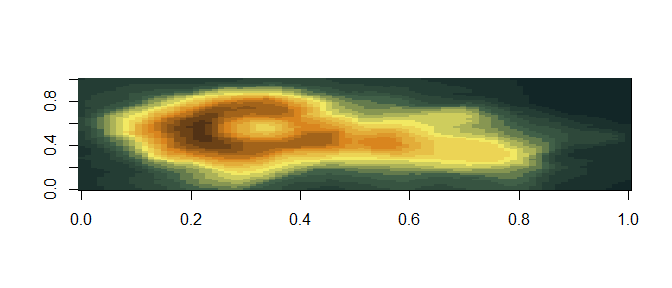
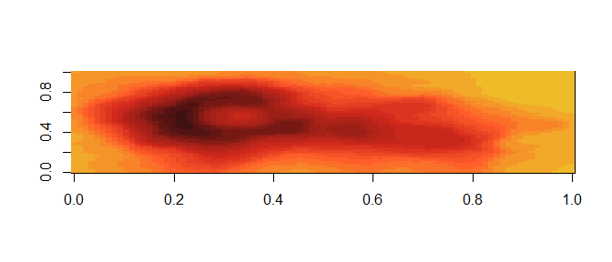
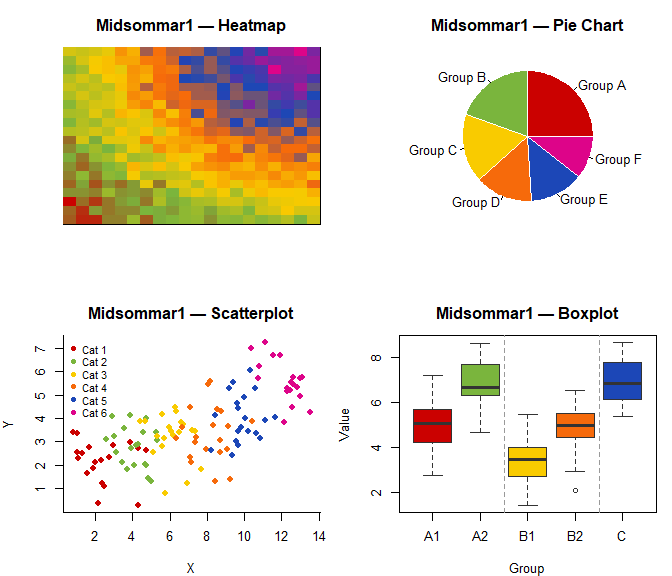
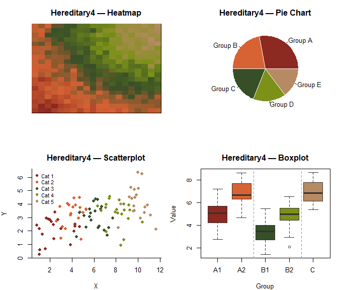
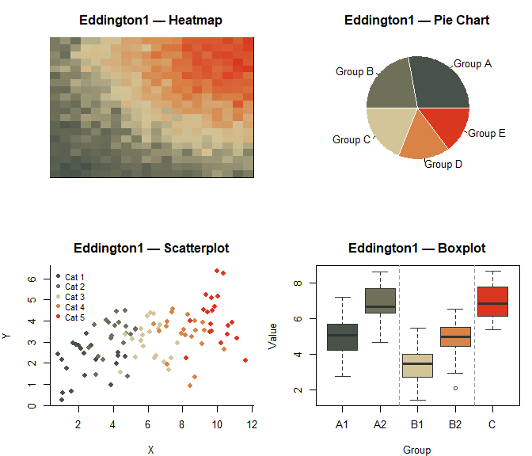

<!-- README.md is generated from README.Rmd. Please edit that file -->

# Ari Aster Palettes

Color palettes inspired by the films of Ari Aster. Each palette is drawn
from the distinct visual language of *Hereditary*, *Midsommar*, *Beau Is
Afraid*, and *Eddington*.

This package is built upon the structure and framework of the
[wesanderson](https://github.com/karthik/wesanderson) package (Karthik
Ram, Hadley Wickham), adapted with original palettes.

## Installation

``` r
# Development version
devtools::install_github("zhorve/aripalettes")
```

## Usage

``` r
library("ariaster")

# See all palettes
names(ari_palettes)
#>  [1] "Hereditary1" "Hereditary2" "Hereditary3" "Hereditary4" "Midsommar1" 
#>  [6] "Midsommar2"  "Midsommar3"  "Midsommar4"  "Beau1"       "Beau2"      
#> [11] "Beau3"       "BeauMonster" "Eddington1"  "Eddington2"  "Eddington3"
```

## Palettes

### Hereditary (2018)

``` r
ari_palette("Hereditary1")
```


``` r
ari_palette("Hereditary2")
```


``` r
ari_palette("Hereditary3")
```


``` r
ari_palette("Hereditary4")
```


### Midsommar (2019)

``` r
ari_palette("Midsommar1")
```


``` r
ari_palette("Midsommar2")
```


``` r
ari_palette("Midsommar3")
```


``` r
ari_palette("Midsommar4")
```


### Beau Is Afraid (2023)

``` r
ari_palette("Beau1")
```


``` r
ari_palette("Beau2")
```


``` r
ari_palette("Beau3")
```


``` r
ari_palette("BeauMonster")
```


### Eddington (2025)

``` r
ari_palette("Eddington1")
```


``` r
ari_palette("Eddington2")
```


``` r
ari_palette("Eddington3")
```


## Continuous palettes

Any palette can be interpolated to generate as many colors as you need:

``` r
pal <- ari_palette("Beau1", 21, type = "continuous")
image(volcano, col = pal)
```



``` r
pal <- ari_palette("Eddington1", 21, type = "continuous")
image(volcano, col = pal)
```



## Palette previews

The `test_palette()` function shows a palette across four chart types —
useful for checking how colors hold up in real use.

``` r
test_palette("Midsommar1")
```



``` r
test_palette("Eddington3")
```



``` r
test_palette("Beau3")
```


